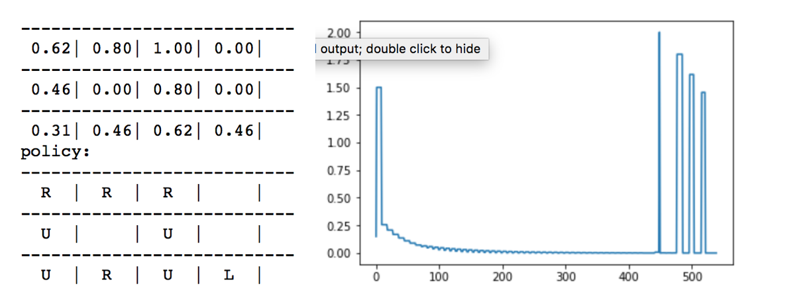
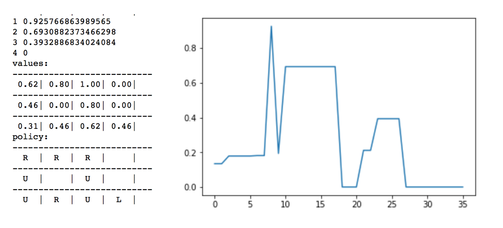
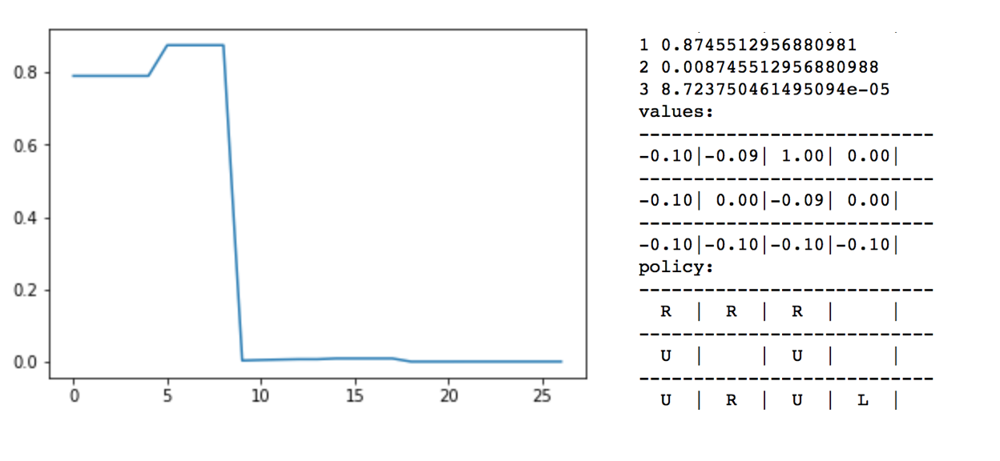

# value_iteration_grid_world

## Indroduction: Value Iteration
 Value-iteration is a fundamental tool in reinforcement learning to solve Markov Decision Processes. The one assumption both value-iteration and policy iteration have is they both assume knowledge of the state-transition rewards. How value-iteration begins is it sets each state in the enviroment to a random value and action. Then it caluculates the immediate reward given that action at that state. In this particular problem we are using the negative grid which rewards each move at -.1. This means we know the reward at each state. This is assumed to deter long policies to terminal state. From here, it looks around at its neighbor states and caluculates their respective values. Here it estimates the value function for this given states and actions. If these values are greater than the previous values, the best action is kept. Basically, it looks at each state and maximizes it's value given different actions. This method guarantees us convergance. We will explore the convergance rates of value-iteration vs. policy-iteration and also look at how gamma affects the rate of convergence in value-iteration.

### Policy vs Value Iteration
 We can see from the graphs below value-iteration converges on the optimal policy much faster than policy-iteration. This should be intuitive becuase the agent is not randoming changing the policy and waiting for value converges to compare values. Value iteration is comparing actions at given states immediately. Thus, it will converge much faster than policy-iteration. Below you can see that it only takes around 35 total iterations to fully converge on an optimal policy and that it only changes policies 4 times. While Policy-iteration changes policies 6 times (count peaks plus convergence to zero) and computes over 500 iterations to get the same optimal policy with the same values at each state.

### Policy-Iteration

  

### Value-Iteration 

  

### How Does Gamma Change Convergence?

 Compared to larger value of gamma in the previous comparison, gamma = .01 shows to converge faster than larger values of gamma. Having too small of a gamma could also change the policy. That also needs to be considered. The reason for this is gamma is your discount rate. Larger values are meant to reward larger amounts further in the future while smaller values of gamma look for acheiving smaller rewards sooner. You can look at similiar to investors would rather have $1000 today than $10,000 30 years from now. Depending on when you what reward your agent in a given space you need to change gamma accordingly. 

  

## Conclusion

 We can see from the graphs below value-iteration converges on the optimal policy much faster than policy-iteration. This should be intuitive becuase the agent is not randoming changing the policy and waiting for value converges to compare values. Value iteration is comparing actions at given states immediately. Thus, it will converge much faster than policy-iteration. Below you can see that it only takes around 35 total iterations to fully converge on an optimal policy and that it only changes policies 4 times. While Policy-iteration changes policies 6 times (count peaks plus convergence to zero) and computes over 500 iterations to get the same optimal policy with the same values at each state.

